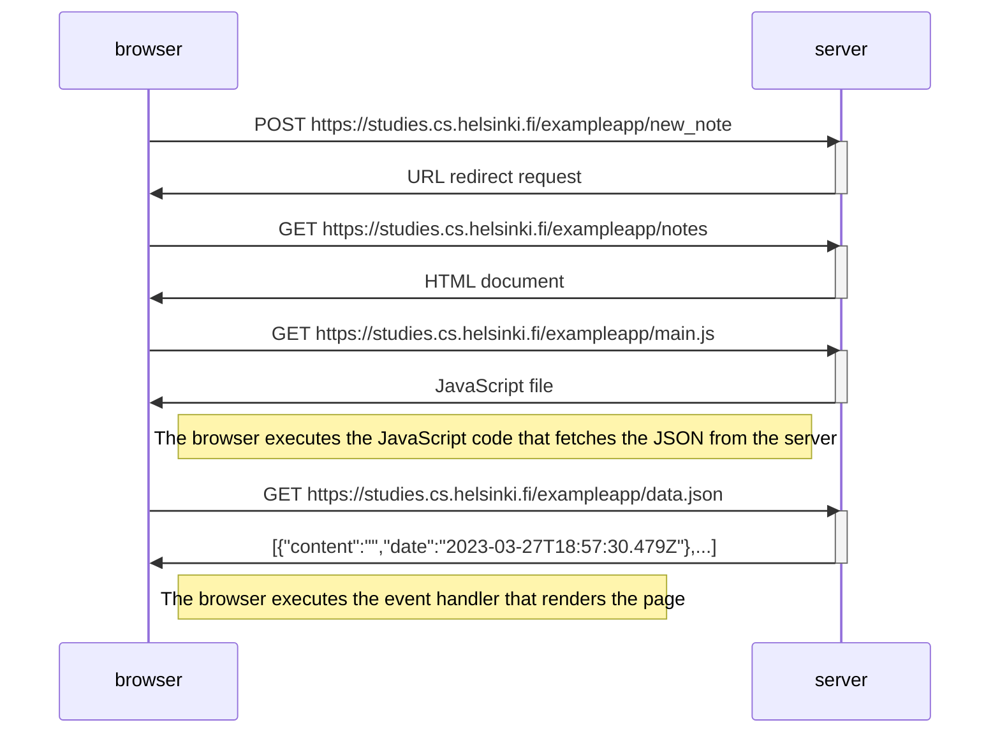

```mermaid
sequenceDiagram
  participant browser
  participant server
  
  browser->>server: POST https://studies.cs.helsinki.fi/exampleapp/new_note
  activate server
  server->>browser: URL redirect request
  deactivate server
  
  browser->>server: GET https://studies.cs.helsinki.fi/exampleapp/notes
  activate server
  server->>browser: HTML document
  deactivate server
  
  browser->>server: GET https://studies.cs.helsinki.fi/exampleapp/main.js
  activate server
  server->>browser: JavaScript file
  deactivate server
  
  Note right of browser: The browser executes the JavaScript code that fetches the JSON from the server
  
  browser->>server: GET https://studies.cs.helsinki.fi/exampleapp/data.json
  activate server
  server->>browser: [{"content":"","date":"2023-03-27T18:57:30.479Z"},...]
  deactivate server
  
  Note right of browser: The browser executes the event handler that renders the page
```
